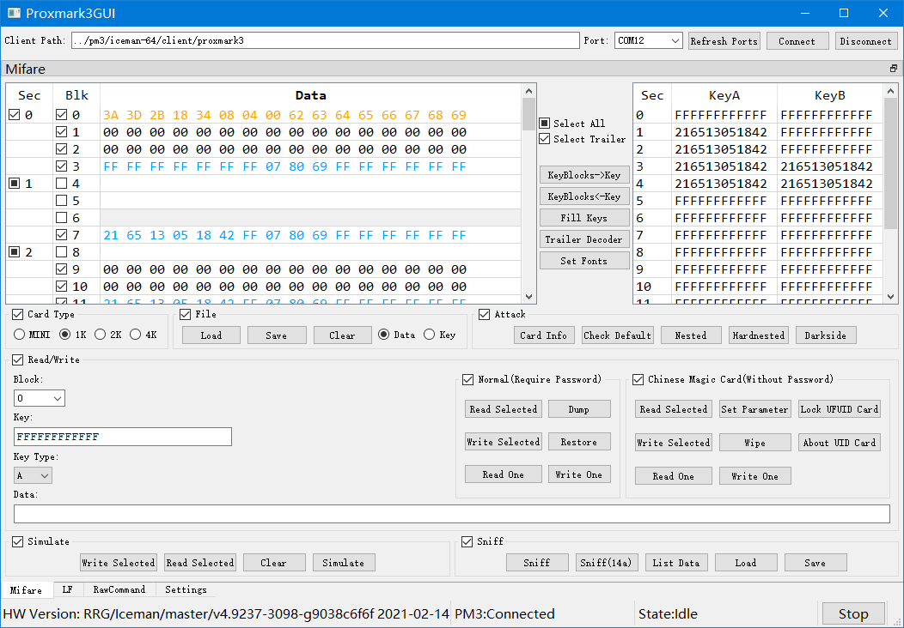
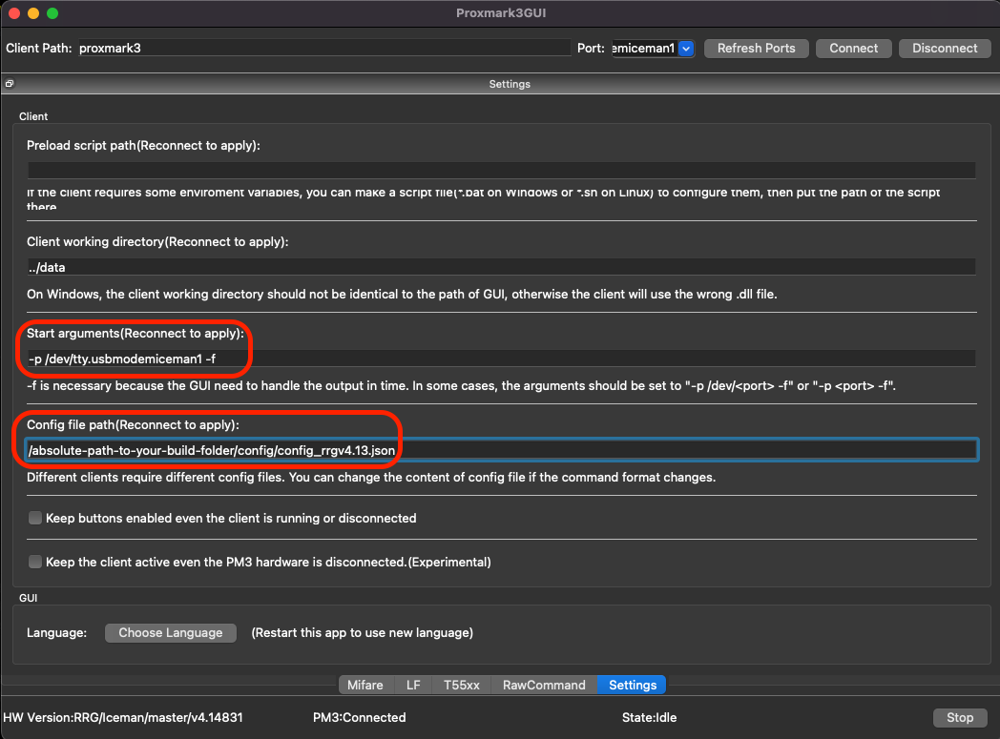

# Proxmark3GUI
  

A cross-platform GUI for [Proxmark3](https://github.com/Proxmark/proxmark3) client

[中文介绍](doc/README/README_zh_CN.md)

***

## Features

+ Easy to find available Serial Port
+ Support raw commands of Proxmark3 client(Official/Iceman)
+ Have a friendly UI to test Mifare cards
    + Support different card size(MINI, 1K, 2K, 4K)
    + Easy to edit Mifare block data
    + Easy to read all/selected blocks with well-designed read logic
    + Easy to write all/selected blocks
    + Support binary(.bin .dump) files and text(.eml) files
    + Analyze Access Bits
    + Support Chinese Magic Card
+ Have basic support for LF commands
+ Customize UI  
+ ...  

***

## Preview
  

[more previews](doc/preview/previews.md)  

***

## About Iceman fork/repo

The [Iceman fork/repo](https://github.com/RfidResearchGroup/proxmark3) has more powerful functions. These guys even developed a new hardware called Proxmark3 RDV4 with smart card support. But the official repo and the Iceman repo is not fully compatible.  
This GUI is compatible with Iceman/RRG repo(tested on v4.13441)  

***

## About Compiled Windows clients

A cool guy [Gator96100](https://github.com/Gator96100) creates [ProxSpace](https://github.com/Gator96100/ProxSpace) and makes it possible to compile both the firmware and the client on Windows.  
Also, he makes the [pre-compiled Windows client](https://www.proxmarkbuilds.org/) so you can download it and run your PM3 client on Windows instantly.  
I included his compiled client in my releases so you can use the GUI on the fly, and you can also use the GUI with your prefered client.  
Great thanks to him.  

***

## Build on Linux

    cd ~
    sudo apt-get update
    sudo apt-get install qt5-default libqt5serialport5 libqt5serialport5-dev 
    git clone https://github.com/wh201906/Proxmark3GUI.git --depth=1
    cd Proxmark3GUI
    mkdir build && cd build
    qmake ../src
    make -j4 && make clean
    cp -r ../config ./
    ./Proxmark3GUI

## Build on macOS

    cd ~
    brew update
    brew install qt@5
    brew link qt5 --force
    git clone https://github.com/wh201906/Proxmark3GUI.git --depth=1
    cd Proxmark3GUI
    mkdir build && cd build
    qmake ../src
    make -j4 && make clean
    cp -r ../config ./
    open Proxmark3GUI.app

> In order for the GUI to connect to the device in macOS, you'd need to tweak the settings a little bit

***
## Tutorial

[1.Quickstart](doc/tutorial/Quickstart/quickstart.md)  
[2.Edit Mifare Classic data](doc/tutorial/Edit_Mifare_Classic_data/Edit_Mifare_Classic_data.md)(Proxmark3 hardware is not necessary)  
***

## Change Log
[Change Log](CHANGELOG.md)
