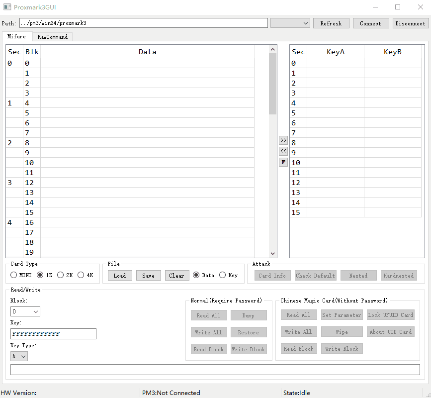
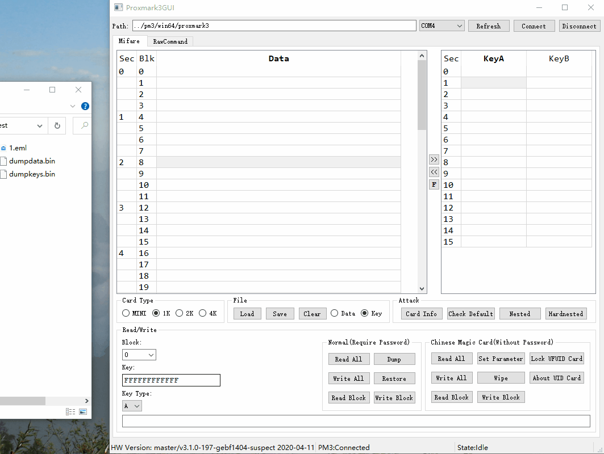
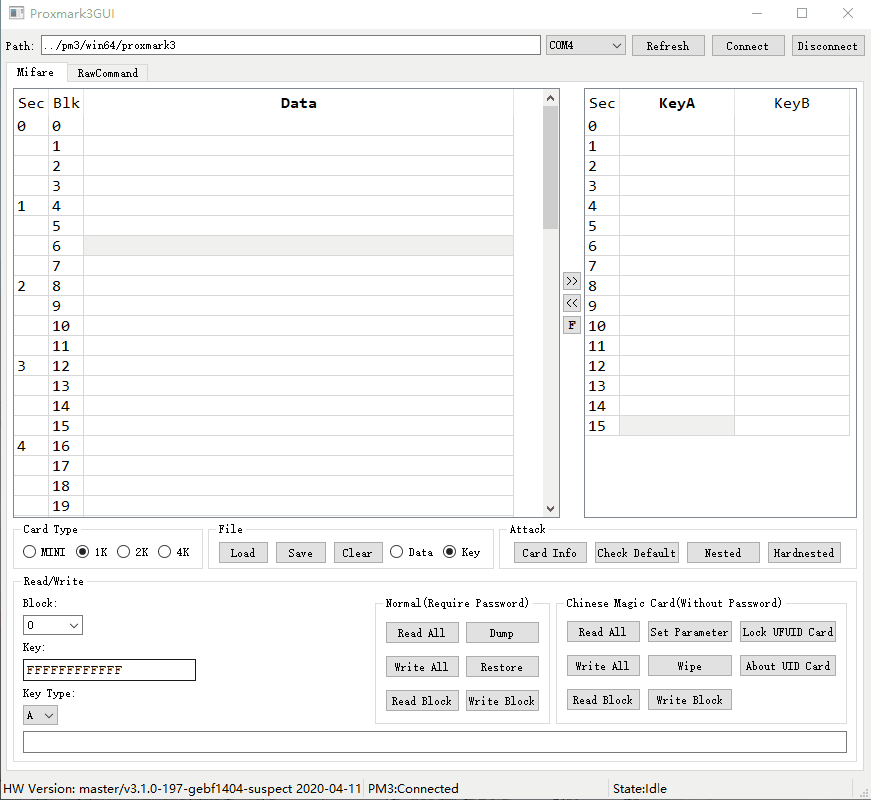
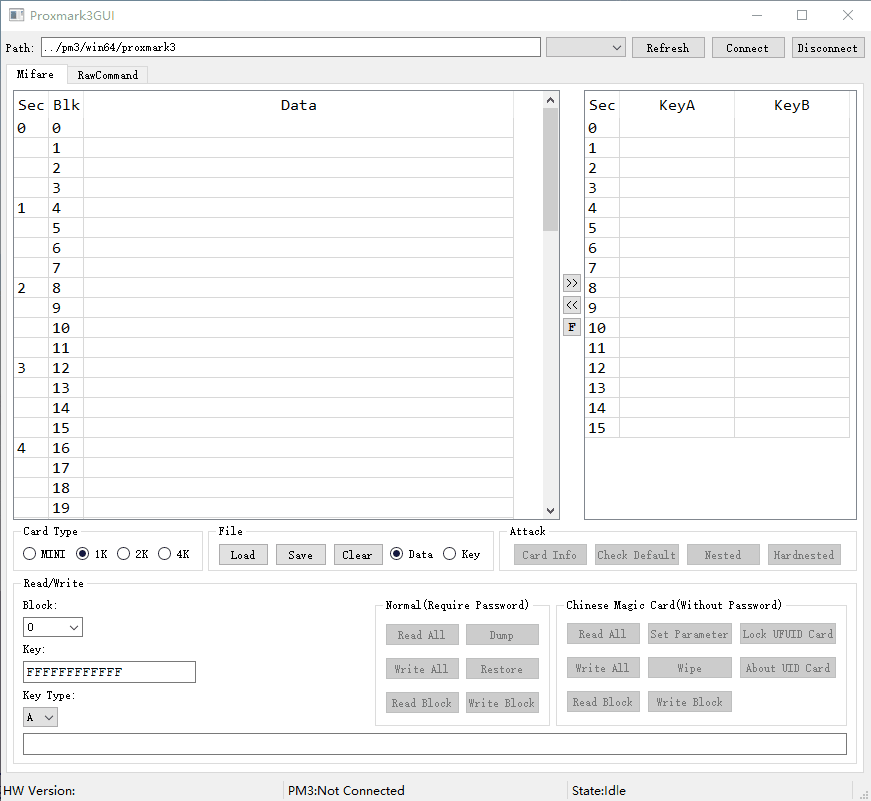

# Proxmark3GUI
一个自制的[Proxmark3](https://github.com/Proxmark/proxmark3) GUI

[English](../README.md)

***

## 特色功能

+ 支持直接输入PM3命令
+ 有针对于Mifare卡（IC卡）的图形界面
+ 支持编辑Mifare扇区数据文件
+ 可以打开二进制/文本格式的扇区数据文件
+ ...

***

## 预览图
  

  

  

  

***

## 更新日志:

### V0.1
+ 支持处理Mifare卡片及相关数据文件

### V0.0.1
+ 一个带串口选择框的实验版本