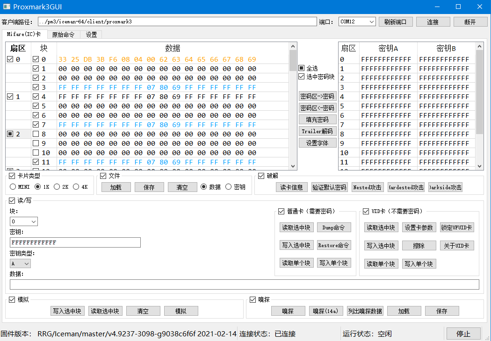

# Proxmark3GUI
一个自制的[Proxmark3](https://github.com/Proxmark/proxmark3) GUI

[English](../../README.md)

***

## 功能

+ 快速查找可用端口并连接
+ 支持直接输入PM3命令(官方版/冰人版)
+ 有针对于Mifare卡（IC卡）的图形界面
    + 支持不同大小的卡片(MINI, 1K, 2K, 4K)
    + 支持编辑Mifare扇区数据
    + 支持读取全卡/选中扇区，读卡逻辑更加智能
    + 支持写入全卡/选中扇区
    + 可以打开二进制/文本格式的扇区数据文件
    + 分析访问控制位（Access Bits）
    + 支持UID卡操作（UID快速读写，UFUID锁卡）
+ 自定义UI界面
+ ...

***

## 预览图
  

 [更多预览](../doc/previews.md)  

***

 ## 关于冰人版
 这个GUI一开始是针对官方版本做的，现在正在尽力让它兼容冰人版的功能  
 （没钱买RDV4也没钱买两台PM3，测一次冰人就要烧一次固件 qwq）

 [已支持功能](../doc/supported_Iceman.md)
***

## 关于预编译Windows客户端

一个国外大佬 [Gator96100](https://github.com/Gator96100) 做了个 [ProxSpace](https://github.com/Gator96100/ProxSpace) 以便在Windows平台上编译PM3固件和客户端，他还把自己编译好的客户端放到了[论坛](http://www.proxmark.org/forum/viewtopic.php?id=3975)里面  
文件都是放到Google Drive上面的，国内网络无法访问，所以我在release版本里面放了个带预编译客户端版本的GUI。这个GUI也可以搭配你自己的客户端使用  
(本来打算在CSDN下载里面放几个最新版客户端的，结果不能把下载币改为0)  
感谢大佬  

***

## 更新日志:

### V0.1.2
+ 优化读卡逻辑
+ UI自定义
+ 自动保存客户端路径
+ 添加访问控制位解码器（也可用于自己构造访问控制位）
+ 支持仅读写选中块
+ 支持部分冰人功能
+ 修复部分bug

### V0.1.1
+ 完成整个Mifare模块（支持模拟卡和嗅探功能）

### V0.1
+ 支持处理Mifare卡片及相关数据文件

### V0.0.1
+ 一个带串口选择框的实验版本