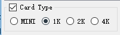
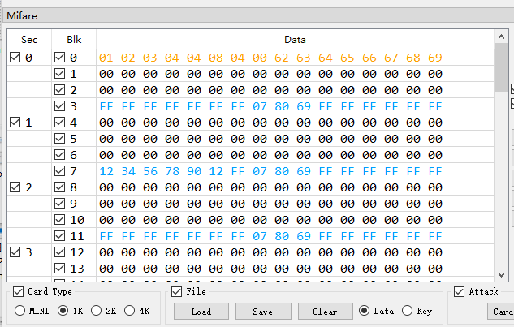
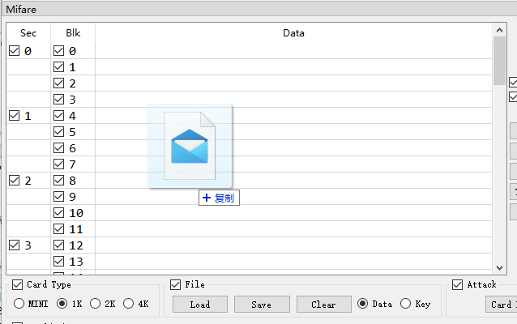
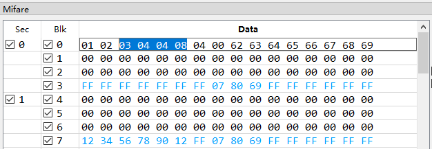
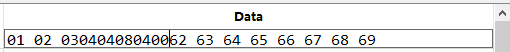

# Edit Mifare Classic data

[中文教程](Edit_Mifare_Classic_data_zh_CN.md)  
This function is useful even if you don't use Proxmark3.  

## About card type
There are four sizes of Mifare Classic card  
+ 320Byte, also known as MINI, S20  
+ 1kB, also known as S50  
+ 2kB  
+ 4kB, alsow known as S70  

Before any operation, you need to choose the right card type.   
If you don't know your card type, you can try 1K first. Mifare Classic S50(1K) is the most common type.  
  

## About file format
This program supports binary data file and text data file.  
Binary data files have the same size of chosen card type.(e.g, type 1K->1024KB data file).  
The file extensions of them are always .dump or .bin.  
You can edit them by hex editor or this program.  
  
Text data files can be open by any text editors.  
The file extensions of them are always .eml or .txt.  
  

## Load
Go to "Mifare"->"File"->, choose "data" on the left and click "Load", then choose the file you want to load. The program will detect the file type by context.  
  
  
Also, you can drag the file into data widget to load the data file.  
  

## Edit
Double click any data row to start edit  
  
You don't need to fill the space between every byte.  
  

## Save
Go to "Mifare"->"File"->, choose "data" on the left and click "Save", then choose the path you want to save and the file format.  
  

## File format convert
If you got a binary data file and you want to edit with notepad, here are the steps.
+ Load the orignal binary file
+ Save it as a text file
+ Edit the new file with whatever you want then save it
+ Load the edited file
+ Save it as binary file  