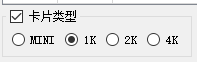
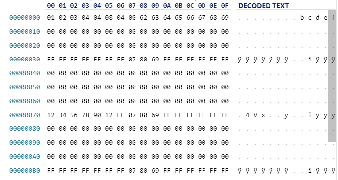
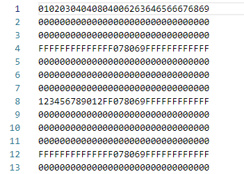
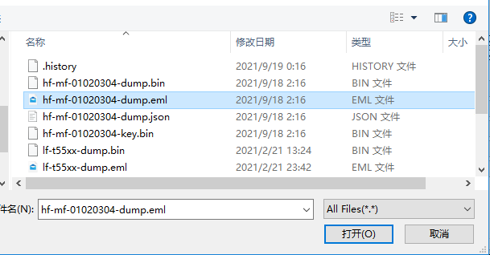
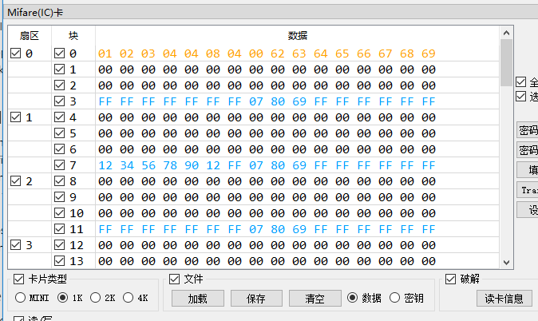
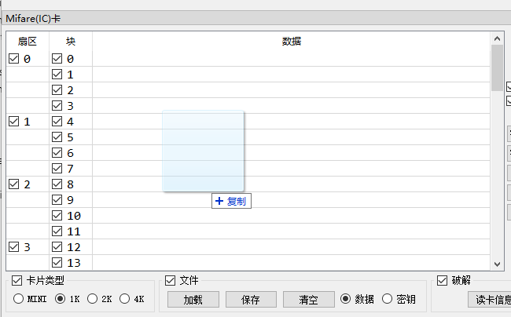
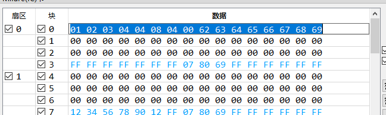
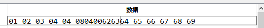
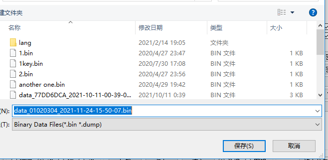

# 编辑Mifare(IC)卡数据

[English](Edit_Mifare_Classic_data.md)  
此功能对没有PM3硬件的用户也很有用。  

## 关于卡类型
Mifare Classic卡有四种不同的容量  
+ 320字节，也被称作MINI卡，S20卡  
+ 1k字节，也被称为S50卡，最常见的型号  
+ 2k字节  
+ 4k字节，也被称为S70卡  

在操作前，请先选择卡类型。  
如果自己不清楚卡类型，可尝试选择1k卡，这是最常见的型号。  
  

## 关于文件格式
此程序支持二进制文件格式和文本文件格式。  
二进制文件的大小和所选卡类型的大小完全相等，文件中的每一个字节对应卡片数据中的一个字节。  
二进制文件的后缀名一般是.dump或.bin。
此类文件需要使用16进制编辑器或者此程序来编辑。  
  
文本文件可被任意文本编辑器打开。  
此类文件的后缀名一般是.eml或.txt。  
  

## 加载文件
在“Mifare”选项卡->“文件”框中勾选“数据”，点击“加载”按钮载入文件。  
此程序会根据文件内容判断待加载的文件格式。  
  
  
程序还支持拖拽加载。你可以直接把文件拖入左边数据显示器中。  
  

## 编辑数据
双击数据行即可开始编辑。  
  
编辑过程中无需手动补全字节间空格。  
  

## 保存文件
在“Mifare”选项卡->“文件”框中勾选“数据”，点击“保存”按钮，选择保存的路径和文件格式即可保存文件。  
  

## 文件格式转换
如果你想用其它文本编辑器编辑二进制文件，可以参考以下步骤
+ 加载原始二进制文件  
+ 保存为文本文件  
+ 用自己喜欢的文本编辑器编辑后保存  
+ 加载编辑后的文件  
+ 保存为二进制文件  